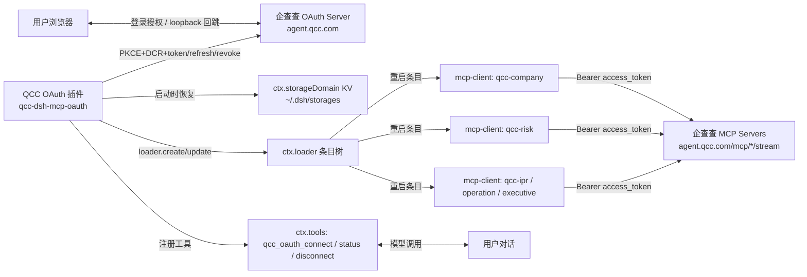

# 企查查 MCP OAuth 插件（DeepSeek Harness）开发规划

> 版本：v1.0 ｜ 日期：2026-08 ｜ 依据：《企查查MCP OAuth 接入文档_20260730_ V1.4》+ DeepSeek Harness rc.6 平台机制实测

---

## 1. 目标与需求

### 1.1 用户故事

> 作为 DeepSeek Harness 用户，我从 GitHub/npm 下载安装"企查查 MCP OAuth 插件"后，在对话中输入"连接企查查"（或首次调用企查查工具），插件自动打开浏览器跳转企查查授权页；我登录授权后，插件自动完成 token 换取与 MCP 连接配置，之后即可直接使用 `mcp__qcc-company__*`、`mcp__qcc-risk__*` 等全部企查查工具，无需手工粘贴 token。

### 1.2 功能需求清单

| # | 需求 | 说明 |
|---|---|---|
| F1 | 一键 OAuth 连接 | 触发后自动完成：Protected Resource Metadata → OAuth Server Metadata → 动态注册客户端 → 打开授权页 → loopback 回调 → 换 token |
| F2 | 一次授权、全 Server 可用 | 一份 `access_token`/`refresh_token` 覆盖企查查 OAuth 集合内的全部 MCP resource（company/risk/ipr/operation/executive） |
| F3 | Token 自动刷新 | 过期前自动 refresh（token 轮换，保存新 refresh_token），刷新失败才重新授权 |
| F4 | 连接状态可视 | 提供 `qcc_oauth_status` 工具：已连接/未连接/过期时间/覆盖资源 |
| F5 | 断开/撤销 | `qcc_oauth_disconnect`：调用 revoke 撤销 refresh_token 并移除配置 |
| F6 | 持久化 | 重启 Host 后自动恢复连接（token 落盘于 DSH 存储域） |
| F7 | 401 容错 | 单资源 401 → 先刷新一次重试 → 仍失败才引导重新授权 |
| F8 | 幂等安装 | 重复安装/重复连接不产生重复条目、不破坏既有配置 |

### 1.3 非功能需求

- **安全**：refresh_token 安全存储；token 不进入 git；撤销时 revoke；token 仅发送给 OAuth 集合内的精确 resource URL。
- **兼容**：macOS / Linux / Windows；DSH web profile（rc.6）；无 client_secret（token_endpoint_auth_method=none）。
- **可维护**：OAuth endpoint 全部从 Server Metadata 动态读取，不硬编码。

---

## 2. 总体架构

### 2.1 组件视图



### 2.2 关键数据流（一键连接）

```
用户: "连接企查查"
 → 模型调用 qcc_oauth_connect
 → 插件: 启动 loopback HTTP 监听 127.0.0.1:{port}/callback
 → 插件: GET https://agent.qcc.com/mcp/company/stream（探测 401 与 resource_metadata，可选）
 → 插件: GET /.well-known/oauth-protected-resource/company/stream → resource + authorization_servers
 → 插件: GET /.well-known/oauth-authorization-server → authorization/token/register/revoke 端点
 → 插件: POST /oauth/register（client_name=DSH-QCC, redirect_uris=[http://localhost:{port}/callback],
        grant_types=[authorization_code, refresh_token], response_types=[code], auth=none）→ client_id
 → 插件: 生成 PKCE（code_verifier/code_challenge=S256/state）
 → 插件: 打开系统浏览器 → /oauth/authorize?response_type=code&client_id=...&redirect_uri=...
        &scope=mcp:tools&state=...&code_challenge=...&code_challenge_method=S256&resource=...
 → 用户: 登录并授权
 → 授权页回跳 http://localhost:{port}/callback?code=...&state=...
 → 插件: 校验 state → POST /oauth/token（grant_type=authorization_code + code_verifier）→ access_token+refresh_token
 → 插件: 将 {issuer, client_id, access_token, expires_at, refresh_token, authorizedResources(5 个), entry_resource}
        写入 ctx.storageDomain KV
 → 插件: loader.update('mcp-qcc-company'|'risk'|'ipr'|'operation'|'executive',
        { config: { headers: { Authorization: 'Bearer <access_token>' } } })  逐个重启条目
 → mcp-client 以新 token 连接，工具注册上屏 → 返回"已连接，共 N 个工具"
```

---

## 3. 关键技术方案（基于 DSH rc.6 实测）

### 3.1 插件形态：DSH Bundle（推荐）

DSH 插件的载体是 npm 包，通过 profile 的 loader 树加载。两种分发形态：

- **Bundle（推荐）**：包内自带 `cordis.patch.yml`，声明 `"dsh": { "bundle": { "patch": "./cordis.patch.yml" } }`；
  用户把包名加入 profile `package.json` 的 `dsh.profile.bundles` 数组即可自动合入插件行。
- **普通插件**：用户在 `cordis.patch.yml` 手写一条 `- insert:` 行引用包名。

插件本体是 Cordis 插件（namespace 导出，与 `@deepseek-ai/dsh-mcp-client` 同构）：

```ts
// lib/index.js
export const name = 'qcc-mcp-oauth'
export const inject = ['tools', 'storageDomain', 'loader']   // 服务注入
export const Config = z.object({ ... })                        // zod schema（schemastery 兼容）
export async function apply(ctx, config) { ... }               // 生命周期
```

### 3.2 OAuth 客户端（lib/oauth.js）

严格按 V1.4 文档实现，全部端点从 metadata 读取：

| 能力 | 实现要点 |
|---|---|
| 元数据发现 | 先 GET protected-resource metadata（含 401 探测与 `WWW-Authenticate` 解析备用），再 GET oauth-authorization-server |
| 动态注册 | `POST {registration_endpoint}`，`token_endpoint_auth_method: 'none'`，无 client_secret；`client_id` 90 天有效、自动续期；遇 `client_id is invalid` 重新注册 |
| PKCE | `code_verifier`：43–128 位 `[A-Za-z0-9._~-]`；`code_challenge = base64url(sha256(verifier))`；`S256`；每次授权全新生成 |
| 授权跳转 | 拼 `/oauth/authorize` 参数；`scope=mcp:tools`；`resource` 用入口 resource（默认 company） |
| Loopback 回调 | Node `http` 监听 `127.0.0.1:{随机端口}/callback`；先启动监听再开浏览器；校验 `state`；`code` 仅用一次 |
| 换 token | `POST /oauth/token`（form-urlencoded）：`grant_type=authorization_code + code + redirect_uri + code_verifier + resource` |
| 刷新 | `grant_type=refresh_token + client_id + refresh_token + resource`；**轮换模式**：必须用响应中的新 refresh_token 覆盖旧值 |
| 撤销 | `POST /oauth/revoke`：`client_id + token=refresh_token + token_type_hint=refresh_token` |
| 打开浏览器 | 平台命令：macOS `open`、Linux `xdg-open`、Windows `start`（`child_process.spawn`，detached） |

### 3.3 Token 存储（lib/grant-store.js）

- 使用 `ctx.storageDomain`（`dsh-storage-domain` 服务，web profile 已挂载，后端 json → `~/.dsh/storages/`，目录 0700）。
- 单记录结构（对齐文档 §11.1）：

```ts
type QccOAuthGrant = {
  issuer: 'https://agent.qcc.com'
  clientId: string
  scope: 'mcp:tools'
  accessToken: string
  accessTokenExpiresAt: number      // epoch ms（now + expires_in - 时钟偏移）
  refreshToken: string
  authorizedResources: string[]      // 文档 §2 的完整 resource 集合（5 个）
  entryResource: string              // 本次授权入口 resource
  clientName: string
  updatedAt: number
}
```

- 标识同一份授权：`issuer + clientId + 账号标识(默认 local) + scope`；支持扩展多账号（见风险 R8）。
- 写入前对敏感字段做权限收敛（文件属主 0600）。

### 3.4 动态配置 MCP 连接（lib/mcp-provision.js）

- 插件启动时：
  - 若 storage 中有有效 grant → 逐个 `loader.update('mcp-qcc-*', { config: { headers: { Authorization: 'Bearer ...' } } })` 恢复连接；
  - 若无 grant → 确保 5 个 mcp-client 条目存在但 `disabled: true`（或由插件自身 `loader.create` 创建），不发起未授权连接。
- 授权成功后：`loader.update` 注入 token header 并 `await loader.await()`；`serverName` 保持不变 → 工具名不变。
- 断开时：`loader.update` 移除 header / `disabled: true`。
- **注意**：`loader.update` 会把条目合并写回 profile 配置树（app-boot 的 ConfigFile 持久化），token 会出现在 `cordis.yml`/`cordis.patch.yml` —— 见 §3.8 安全设计。

### 3.5 工具面（lib/tools.js）

通过 `ctx.tools.register(def)` 注册 3 个原生工具（`{ name, description, parameters, output, execute }`）：

| 工具 | 参数 | 行为 |
|---|---|---|
| `qcc_oauth_connect` | `server?`（默认 company）| 执行 §2.2 全流程；返回连接结果与可用资源清单 |
| `qcc_oauth_status` | — | 返回连接状态、token 过期时间、授权资源、mcp 条目状态 |
| `qcc_oauth_disconnect` | — | revoke + 清 grant + 停用 mcp 条目 |

UX 补充：连接成功后向会话输出一句引导（"已连接企查查，可查询工商/风险/知产/经营/董监高数据"）；首次调用任意 `mcp__qcc-*` 工具返回 401 时，模型按 F7 先触发 `qcc_oauth_connect`。

### 3.6 刷新 / 续期 / 401 处理

- **主动刷新**：`apply` 内注册定时器（复用 `@deepseek-ai/cordis-plugin-timer` 或 setTimeout 计划），在 `expires_at` 前约 5 分钟执行 refresh；成功后更新 grant（新 access + 新 refresh）并 `loader.update` 同步 header；失败标记待重连。
- **401 容错链**（对齐文档 §11.3/§13）：某 resource 调用 401 → 若本次 grant 未刷新过则刷新一次并重试原请求 → 刷新失败（`invalid_grant`/refresh 缺失）→ 更新状态为"需重新授权"，提示用户执行 `qcc_oauth_connect`。
- **client_id 续期**：刷新/换码成功即自动续期；遇 `client_id is invalid` → 重新动态注册后走一次静默刷新，避免用户重新登录。

### 3.7 多 resource 复用（授权集合）

- 授权成功后把文档 §2 的 **5 个 resource** 写入 `authorizedResources`；company 与 risk/ipr/operation/executive 连接共享同一 grant。
- `getServerList()` 内置默认 5 个：company / risk / ipr / operation / executive。
- **history / legal-regulation / legal-case / tender 不在文档 OAuth 集合内**（本环境此前用直连 token 配了 9 个 Server）——插件默认只管理集合内 5 个；其余 4 个提供"直连 token 透传"兼容开关（env `QCC_LEGACY_TOKEN`），并在 README 注明需与企查查确认是否纳入 OAuth 集合（见风险 R1）。

### 3.8 安全设计

1. **存储**：token 只写 `ctx.storageDomain` KV（`~/.dsh/storages/`，0700），不进 git、不进对话历史。
2. **loader 树持久化**：`loader.update` 会合并回 profile 配置树 → 建议：
   - 安装后引导用户 `chmod 600 ~/.dsh/profiles/web/cordis.yml`；
   - 插件提供 `persistTokens: false` 选项（默认 true），关闭时插件在每次写盘事件后从条目 config 摘除 token 字段（配合 `loader/config-update` 事件重放），仅保留内存连接；
   - README 明确"token 属于用户本机凭证，勿将 profile 目录加入任何仓库"。
3. **发送范围**：Bearer 只发给 `authorizedResources` 精确匹配的 HTTPS URL。
4. **撤销**：disconnect / 插件卸载时调用 revoke。
5. **PKCE**：强制 S256，verifier 不落盘、不回显。

---

## 4. GitHub 仓库结构

```
qcc-mcp-oauth/                        # 建议仓库名：qcc-mcp-oauth（或 dsh-qcc-mcp-oauth）
├── package.json                      # name: qcc-dsh-mcp-oauth；dsh.bundle.patch 声明
├── cordis.patch.yml                  # bundle patch：insert qcc-oauth 插件行（含 Config 默认值）
├── lib/
│   ├── index.js                      # 插件入口：name/inject/Config/apply；生命周期编排
│   ├── oauth.js                      # OAuth 客户端（发现/注册/PKCE/换码/刷新/撤销）
│   ├── callback-server.js            # loopback 回调服务器（127.0.0.1 随机端口）
│   ├── grant-store.js                # ctx.storageDomain KV 封装 + 序列化
│   ├── mcp-provision.js              # loader.create/update/remove mcp-client 条目
│   ├── tools.js                      # qcc_oauth_connect/status/disconnect 注册
│   └── util.js                       # 浏览器打开、随机数、错误归一
├── test/
│   ├── mock-oauth-server.mjs         # 可配置的假 agent.qcc.com（metadata/register/authorize/token/revoke）
│   ├── oauth.test.mjs
│   ├── grant-store.test.mjs
│   ├── mcp-provision.test.mjs
│   └── e2e.test.mjs                  # 真实端点冒烟（需测试账号，CI 手动触发）
├── README.md                         # 中英双语：安装/一键连接/管理/FAQ
├── LICENSE                           # MIT（或按企查查要求）
├── .github/
│   ├── workflows/ci.yml              # lint + test + build
│   └── workflows/release.yml         # tag → npm publish + GitHub Release
└── docs/
    ├── INSTALL.md
    └── OAUTH-IMPLEMENTATION.md       # 对照 V1.4 文档的逐条实现说明
```

### package.json 关键字段

```jsonc
{
  "name": "qcc-dsh-mcp-oauth",
  "version": "0.1.0",
  "type": "module",
  "main": "lib/index.js",
  "dsh": { "bundle": { "patch": "./cordis.patch.yml" } },
  "peerDependencies": {
    "@deepseek-ai/dsh-mcp-client": "^0.1.0-rc.6"
  }
}
```

---

## 5. 开发任务分解（里程碑）

### M0 环境与脚手架（0.5 天）
- [ ] 在 workspace 建 `qcc-mcp-oauth/` 工程；`npm init` + 基础文件
- [ ] 本地搭一个 DSH web profile 的**独立测试实例**（复制 `~/.dsh/profiles/web` 为 dev profile，避免干扰当前 GUI）
- [ ] 打通"包 → bundle patch → 插件行加载"最小回路（空插件打印日志）

### M1 OAuth 核心（2 天）
- [ ] `oauth.js`：metadata 发现（protected-resource + authorization-server）
- [ ] 动态注册客户端（含 `client_id` 失效重注册）
- [ ] PKCE 生成/校验 + 授权 URL 拼装
- [ ] `callback-server.js`：loopback 监听、state 校验、code 单次使用
- [ ] 换 token / refresh（轮换）/ revoke
- [ ] **验收**：对 `test/mock-oauth-server.mjs` 全流程通过；对真实 `agent.qcc.com` 手动冒烟通过

### M2 存储与 MCP 配置集成（1.5 天）
- [ ] `grant-store.js`：storageDomain KV 读写 + 0600 权限
- [ ] `mcp-provision.js`：启动恢复、授权后 `loader.update` 注入 header、断开停用
- [ ] 5 个 resource 的授权集合映射 + legacy 4 个 Server 兼容开关
- [ ] **验收**：授权后 dev 实例出现 `mcp__qcc-company__*` 等工具且可真实查询；重启 Host 自动恢复

### M3 工具面与一键连接 UX（1 天）
- [ ] `tools.js`：connect / status / disconnect 三工具
- [ ] 浏览器打开（三平台）、连接中/失败/超时提示
- [ ] 首次调用 401 时的"引导重新连接"提示
- [ ] **验收**：对话输入"连接企查查"即可完成全流程；status 正确；断连后工具消失

### M4 刷新/撤销/异常处理（1 天）
- [ ] 过期前 5 分钟自动刷新 + 新 refresh_token 落库 + 同步 header
- [ ] 401 容错链（刷新一次→重试→引导重授权）
- [ ] disconnect revoke + 幂等安装（重复 connect 不重复建条目）
- [ ] **验收**：模拟 token 过期（mock server 缩短 expires_in）自动刷新成功；revoke 后 token 失效

### M5 测试与加固（1.5 天）
- [ ] 单元/集成测试补齐（§6）
- [ ] 安全审查：token 不进日志/历史/仓库；PKCE 强制；发送范围校验
- [ ] 三平台浏览器打开与 loopback 兼容性验证
- [ ] README / docs 文档定稿

### M6 GitHub 发布与分发（0.5 天）
- [ ] 仓库初始化（LICENSE、.gitignore、CI、Release workflow）
- [ ] npm 发布（`qcc-dsh-mcp-oauth`，或确认可用 scope/名称）
- [ ] GitHub Releases + 安装文档
- [ ] **验收**：全新机器按 README 三步装好并一键连接成功

---

## 6. 测试计划

| 层级 | 内容 | 工具 |
|---|---|---|
| 单元 | PKCE 生成/校验、grant 序列化/反序列化、URL 拼装、错误归一 | node:test |
| 集成 | 对 mock OAuth server 全流程（注册/授权/换码/刷新/撤销/401/轮换） | node:test + 本地 HTTP |
| 集成 | loader 动态更新 mcp-client 条目（dev profile） | dev profile 冒烟脚本 |
| E2E | 真实 agent.qcc.com（测试账号）：一键连接 → 查一个工具 → 重启恢复 → 断开 | 手动/CI 手动触发 |
| 兼容 | macOS/Linux/Windows 浏览器打开 + loopback 回调 | 三平台 CI matrix（至少手动） |

---

## 7. GitHub 发布与分发

### 7.1 用户在 DeepSeek Harness 中获取的三种路径

| 路径 | 命令/操作 | 适用 |
|---|---|---|
| A. npm 包（推荐） | `dsh plugin --profile web add qcc-dsh-mcp-oauth`，再将包名加入 profile `package.json` 的 `dsh.profile.bundles` | 已发布 npm |
| B. GitHub 直装 | `dsh plugin --profile web add github:qcc/qcc-mcp-oauth`（pnpm 支持 git 依赖） | 未发 npm 前即可用 |
| C. 源码构建 | clone → `pnpm install` → 用 `--patch` 指向本地 `cordis.patch.yml` | 开发者/调试 |

> "查询并下载"：DSH rc.6 无插件市场 UI（settings 插件卡片仅对仓库内插件开放，见风险 R7），因此分发以 **README 安装指引 + GitHub Releases + npm registry** 为主；可附带一个 `install.sh` 脚本自动完成"pnpm add + bundles 注册 + 重启提示"。

### 7.2 发布清单

- [ ] GitHub repo：`qcc/qcc-mcp-oauth`（public），LICENSE(MIT)、.gitignore（不含任何 token/本地 profile 文件）
- [ ] CI：`pnpm lint && pnpm test`（Node 20/22/24）
- [ ] Release workflow：打 tag → npm publish + GitHub Release 附说明
- [ ] README（中英）：功能、三步安装、一键连接、FAQ（含"为什么只有 5 个 Server"、token 安全、client_id 90 天）
- [ ] 变更记录 CHANGELOG

---

## 8. 风险与注意事项

| # | 风险/事项 | 影响 | 对策 |
|---|---|---|---|
| R1 | 文档 OAuth 集合仅 5 个 resource（company/risk/ipr/operation/executive）；history/legal-regulation/legal-case/tender 未在列 | 这些 Server 无法用 OAuth token | 插件默认管理 5 个；其余走 legacy 直连 token 开关；README 注明待与企查查确认 |
| R2 | `loader.update` 会把 token 合并写回 profile 配置树（明文落盘） | token 泄露面 | §3.8：存储域 0600、cordis.yml chmod 600、`persistTokens:false` 可选、文档警示 |
| R3 | `client_id` 90 天有效，长期不用被清理 | 连接失效 | 自动续期感知；`client_id is invalid` 时静默重注册+刷新 |
| R4 | refresh token 轮换：旧 token 立即失效 | 并发刷新会互相作废 | 刷新串行化（单飞队列），失败重试用最新 token |
| R5 | loopback 端口占用/防火墙 | 回调收不到 | 随机端口+失败重试；macOS/Windows 防火墙放行说明 |
| R6 | Web/SaaS 回调需企查查白名单；private-use scheme 需确认 | 仅本地可用 | 插件面向本地桌面（loopback），符合 Native 场景；如做 SaaS 版另走白名单流程 |
| R7 | 第三方插件无法注册 Settings 卡片（apiproxy allowlist 限制） | 无图形化管理页 | UX 走对话工具（connect/status/disconnect），README 说明 |
| R8 | 多实例/多账号 | 授权状态串扰 | grant 键含账号标识；默认单账号，预留多账号扩展 |
| R9 | 与现有 9-Server 静态 Bearer 配置共存/迁移 | 双 token 并存 | 插件接管后提示移除 `cordis.patch.yml` 中的旧 `Authorization` 明文行；提供迁移说明 |
| R10 | Host 重启瞬间 401 | 首屏工具报错 | 插件启动先恢复 grant 再放行；mcp-client `failOnStartupError:false` |

---

## 9. 验收标准（Definition of Done）

1. 全新 DSH web 实例按 README 三步安装插件后，对话输入"连接企查查"即可完成 OAuth 全流程（浏览器授权页 → 自动回调）。
2. 授权后 `mcp__qcc-company__get_company_registration_info` 等工具可真实返回数据；company/risk/ipr/operation/executive 五个 Server 均可用同一授权。
3. 重启 DSH Host 后自动恢复连接，无需重新授权；token 过期前自动刷新（mock 缩短有效期可验证）。
4. `qcc_oauth_status` 正确反映状态；`qcc_oauth_disconnect` 撤销成功且工具下线。
5. 重复安装/连接幂等；token 不进入 git/日志；`~/.dsh/storages` 与 profile 配置权限收敛。
6. GitHub 仓库公开可用：CI 绿、Release 含包与安装文档、npm 可安装。

---

## 10. 下一步行动建议

1. 先与企查查确认两点：① history/legal-regulation/legal-case/tender 是否纳入 OAuth 集合；② 插件展示名 `client_name` 是否需要指定（授权页展示）。
2. 确认 npm scope/包名（`qcc-dsh-mcp-oauth`）与 GitHub 仓库名。
3. 建议按 **M0 → M1 → M2** 顺序开工，M1 完成后即可在 mock + 真实端点验证 OAuth 可行性，再投入 loader/存储集成。
